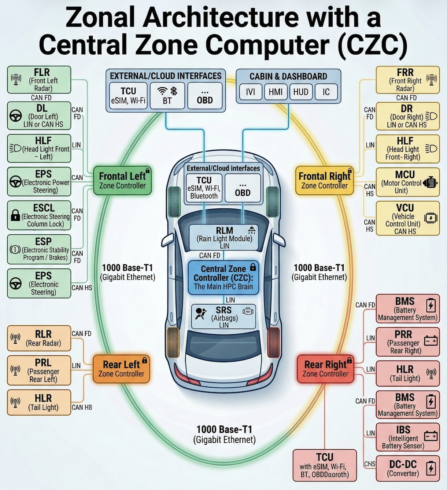

# Automotive Cybersecurity TARA: 4-Corner Zonal Architecture (ISO/SAE 21434)
## Executive Summary
As the automotive industry transitions to the **Software-Defined Vehicle (SDV)**, securing the vehicle network is as critical as functional safety (ISO 26262). This repository contains a comprehensive Mock **Threat Analysis and Risk Assessment (TARA)** conducted in accordance with **ISO/SAE 21434**, implementing my learnings from the Udemy certification [(‘[Practical Guide: ISO 21434, TARA for Automotive Cybersecurity]')](https://www.udemy.com/share/10cN513@xRNIVJ7SCKM2ge-SCWDwUyvxYIGl80EB_o4jcCpXLz_eihQZQp-QPBfc9Hr1C0Tl/),and with additional supplements from TÜV SÜD and [Rappel Cybersecurity](https://www.youtube.com/@Rappel-Cybersecurity/videos).

The assessment targets a modern **4-Corner Zonal Architecture with a Central Zone Computer (CZC)**, analyzing 5 distinct attack vectors across Physical Edge, Remote/Cloud, Wireless, and Diagnostic interfaces.

## Item Definition & Architecture Scope
**System Overview:** The target architecture relies on a Gigabit Ethernet (1000 Base-T1) backbone connecting a Central Zone Computer (CZC) to four location-based Zone Controllers. This architecture introduces complex cybersecurity challenges, particularly **Mixed-Criticality Routing**, where low-security body domains share physical gateways with high-security powertrain/ADAS domains.

## Highlighted Threat Scenarios
*(Below are 2 of the 5 detailed threat models. Please refer to the attached Excel workbook for the complete analysis).*

### 1. Mixed-Criticality Gateway Bypass (Physical Edge Pivot Attack)
**Target Asset:** Frontal Left Zone Controller (FL-ZC) Routing Engine & EPS CAN FD Network.
**Attack Vector:** Local (Exposed exterior mirror/door wiring).
**Attack Path:** An attacker physically accesses the low-security LIN door wiring harness, splices a network injector, and exploits a routing vulnerability inside the FL-ZC to pivot onto the high-security CAN FD bus.
**Damage Scenario:** Injection of spoofed Electronic Power Steering (EPS) torque commands at highway speeds (Severe Safety Impact).
**STRIDE Threat:** Elevation of Privilege & Spoofing.
**Assessed Risk & CAL:** **Risk Level 5 (Critical) | CAL 4**
**Cybersecurity Goal (Mitigation):** The FL-ZC shall enforce strict hardware/software network isolation (e.g., VLANs, Firewalls) blocking powertrain frames originating from body edge nodes. EPS shall authenticate all torque commands using **SecOC** (Secure On-Board Communication).

### 2. Flawed System-Wide OTA Update (Supply Chain / Cloud Attack)
**Target Asset:** Central Zone Computer (CZC) OTA Update Manager & TCU.
**Attack Vector:** Network (Cloud attack / Cellular Network (eSIM)).
**Attack Path:** An attacker compromises the OEM backend server or executes a cellular MitM attack to push a malicious firmware payload. The CZC fails to cryptographically verify the payload and flashes it to multiple Zone Controllers via the Ethernet backbone.
**Damage Scenario:** Vehicle fleet is bricked (Ransomware) or a remote-control backdoor is installed in the powertrain domain.
**STRIDE Threat:** Tampering & Spoofing.
**Assessed Risk & CAL:** **Risk Level 4 (High) | CAL 4**
**Cybersecurity Goal (Mitigation):** The CZC shall enforce **Secure Boot** and strict asymmetric cryptographic verification (RSA/ECC) of all OTA payloads. The TCU must mandate mutually authenticated TLS 1.3 with the OEM backend to ensure UN R156 compliance.

## Complete Threat Catalog
[ Click Here to Download the Complete TARA Excel Workbook](`TARA_Zonal_SDV_Architecture.xlsx`)
The attached TARA matrix contains the full risk assessments, impact calculations, and attack feasibilities for:
1. FL-ZC Door-to-Steering Pivot Attack (Highlighted)
2. CZC Flawed System-Wide OTA Update (Highlighted)
3. FR-ZC Physical CAN Injection via Exposed ADAS Sensor
4. CZC Diagnostic Attack via OBD-II Port (UDS Service Exploitation)
5. CZC IVI Wi-Fi Stack Attack (Evil Twin / MitM)

## Methodology & Frameworks
**Standard:** ISO/SAE 21434 (Road vehicles — Cybersecurity engineering)

**Threat Modeling:** STRIDE

**Risk Calculation:** Impact (Safety, Financial, Operational, Privacy) + Attack Feasibility (Time, Expertise, Knowledge, Opportunity, Equipment).

**Mitigations:** AUTOSAR Crypto Stack, SecOC, Hardware Firewalls, UDS Authentication (Service 0x29).

---
*Created by Harshitha Nidaghatta Siddaraju | Automotive Embedded Software Engineer transitioning Classic AUTOSAR expertise into SDV Cybersecurity.*
